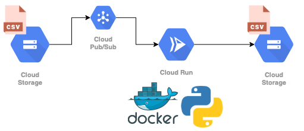
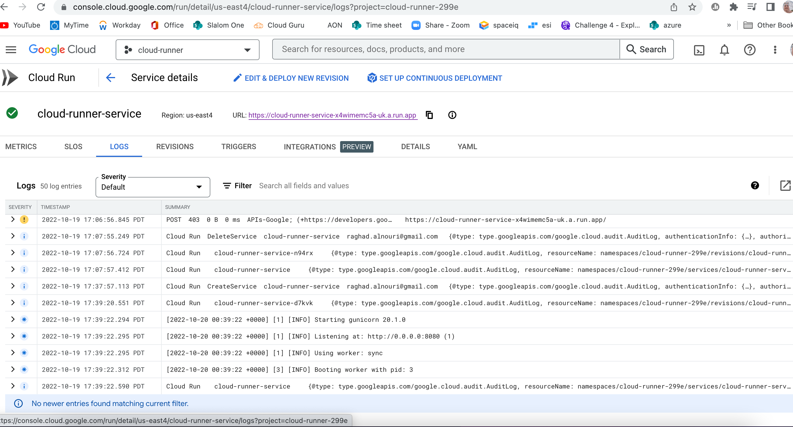

# The design of the structure
Serverless, containerized tasks using:
1- Google Cloud Run
2- Pub/Sub
3-Cloud Storage and Terraform

<p align="center">
  
</p>

## Overview


We will build a serverless service which will listen to new files in a Cloud Storage bucket via Pub/Sub, run some small containzerized process via Cloud Run once files are available and publish results of the process to another bucket.

As a process here I will run a simple logistic regression model.

- [Google Cloud Run](https://cloud.google.com/run) is a service to run containers on a serverless infrastructure.
- [Google Pub/Sub](https://cloud.google.com/pubsub/architecture) is a asynchronous messaging service which allows decoupling of sender and receiver of messages.
- [Google Cloud Storage](https://cloud.google.com/storage) is a service to store objects.
- [terraform](https://www.terraform.io/) is a infrastructure-as-code software.
- Logistic regression


## Prerequisites

Google authentication to enable planning and applying with terraform and updating the image:

```
gcloud auth application-default login
```

You can check if you are authenticated with the right user using `gcloud auth list`.

# Creating a containerized model
Let us build a very simple containerized workflow. We will use Logistic regression as baseline for now. We will fit the model on the fly and produce batch-predictions, without storing the actual model. This is feasible, because the fitting time of the model is quite low. 
(we can alternatively use a pre-trained model by pulling a simple model artifact from external storage. Could be used when the model training is computationally expensive which is not the case here)

## Setup

Using terraform, we plan the services as follows:

- the Cloud Run service to process files from the input bucket
- the Cloud Storage notifications to listen to new files in the input bucket
- the Pub/Sub topic for the Cloud Storage notifications
- the Pub/Sub subscription to subscribe the Cloud Run service to the Cloud Storage notifications topic
- the app container to be used by Cloud Run

With this plan, we can build our infrastructure using the setup script: setup.sh. This will

1- build the container once so its available in cache
2- initialize and apply Terraform
Run terraform plan & apply using the setup script `setup.sh` which contains the following steps:

```
# build container once to enable caching
(cd app && 
	docker build -t cloud-runner .)

(cd terraform && 
	terraform init && 
	terraform apply)
```


We can upload the dataset to GCS with `gsutil`:

```
gsutil cp app/data/financial_statements.csv gs://my-cloud-runner-input-bucket/financial_statements.csv
```

If our infrastructure works properly we can check the Cloud Run logs in the Google console, and We should see that the container received some data and returning an output.

we can try to upload the test file app/data/financial_statements.csv to GCS using gsutil. We will fetch input and output bucket name from the terraform output and extract them using jq:

'''

INPUT_BUCKET=$(cd terraform && terraform output -json | jq -r .input_bucket.value)
OUTPUT_BUCKET=$(cd terraform && terraform output -json | jq -r .output_bucket.value)
gsutil cp app/data/financial_statements.csv gs://${INPUT_BUCKET}/financial_statements.csv

'''
## Deploy new image (Updating the container)

To manually update the container with a new latest version we can use the deploy.sh script. We need to to rebuild and push the image, update the Cloud Run service to pick it up and shift traffic.

Run the simple deploy script `deploy.sh` which contains the following steps:

```
# get project id, image output and service name from terraform output
PROJECT_ID=$(cd terraform && terraform output -json | jq -r .project_id.value)
IMAGE_URI=$(cd terraform && terraform output -json | jq -r .image_uri.value)
SERVICE_NAME=$(cd terraform && terraform output -json | jq -r .service_name.value)

# build and push image
(cd app && 
	./build.sh && 
	IMAGE_URI=$IMAGE_URI ./push.sh)

# update image
gcloud --project $PROJECT_ID \
	run services update $SERVICE_NAME \
	--image $IMAGE_URI \
	--platform managed \
	--region europe-west3

# send traffic to latest
gcloud --project $PROJECT_ID \
	run services update-traffic $SERVICE_NAME \
	--platform managed \
	--region europe-west3 \
	--to-latest

```
We can view the logs in the Cloud Run console:


<p align="center">
  
</p>


## Destroy

Run the destroy script `_destroy.sh` to delete(!) the bucket contents and the project or execute the following steps:

```
# # delete bucket content
# gsutil rm "gs://my-cloud-runner-input-bucket/**"
# gsutil rm "gs://my-cloud-runner-output-bucket/**"
# 
# # destroy infra
# (cd terraform && 
# 	terraform state rm "google_project_iam_member.project_owner" &&
# 	terraform destroy)
```

## Clarifications

- Cloud Run run has a maximum timeout of 15 minutes (it is useless for more time consuming tasks).
- Google Pub/Sub has a maximum acknowledge time of 10 minutes (it is useless for more time consuming tasks). 
- The current script can only handle one request at a time, therefore we set the container concurrency to 1. However,Cloud Run natively handles multiple requests by using multiple containers. The maximum number of parallel Cloud Run containers is also configurable, and by default set to 1000.
